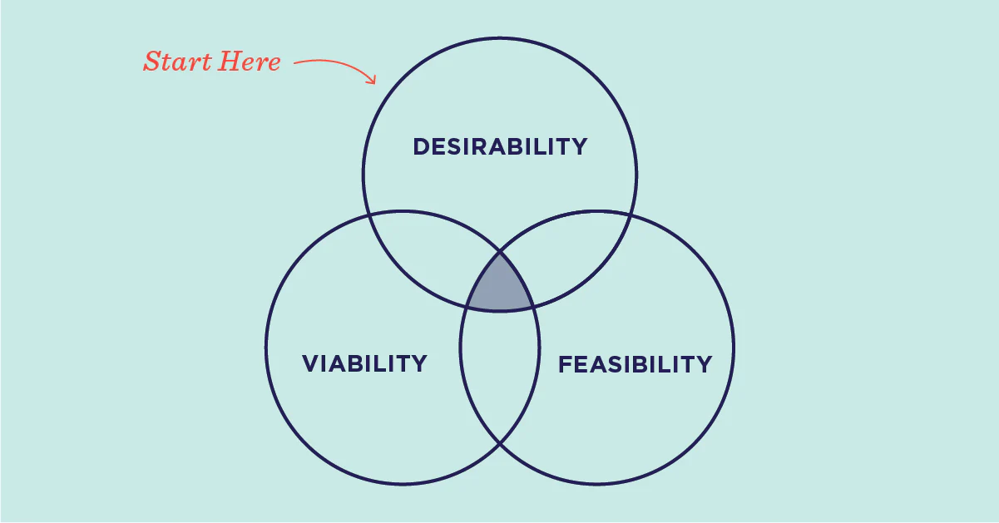
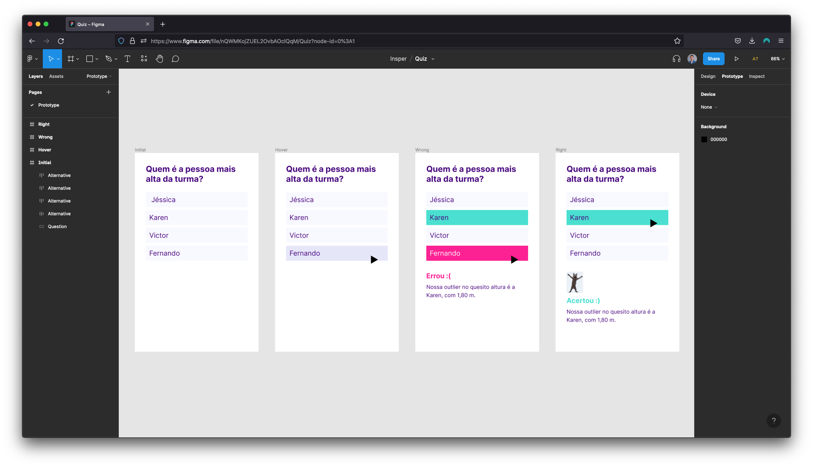

# Lecture A — Week 1

## Syllabus

The syllabus was made available via BlackBoard.

## Design

- There are [many approaches](https://en.wikipedia.org/wiki/Design#Process) to design (and many disagreements)
- This course is focused on [user-centered design](https://en.wikipedia.org/wiki/User-centered_design)
- One of its most famous approaches is [Design Thinking](https://www.ideou.com/blogs/inspiration/what-is-design-thinking), by IDEO:

### How?

This process was formalized by [NNGroup](https://www.nngroup.com/articles/design-thinking/):

Personally, I believe the you only need to remember these 3 steps (adapted from NNGroup):

> “While design thinking is simply an approach to problem solving, it increases the probability of success and breakthrough innovation.”

Quote by [NNGroup](https://www.nngroup.com/articles/design-thinking/)

### In Real Life

Samples from my own [portfolio](https://vsueiro.com/).

- [Dinosaur Toy](https://vsueiro.com/work/montadino) example

- Natural selection analogy (from [Wikimedia](https://commons.wikimedia.org/wiki/File:Mutation_and_selection_diagram.svg)):

- [Interactive story](https://vsueiro.com/) example:

- [Similar diagram](https://www.figma.com/file/vT0ZkbKerSEglVODNCdqEg/Creative-process?node-id=0%3A1
) (but actual design project)

## User Experience Design

It’s… [interdisciplinary](https://github.com/envisprecisely/disciplines-of-ux)… to say the least.

Initials|Term
---|---
UX | User Experience
IxD | Interaction Design

## Interaction Design

- [Media Equation](https://en.wikipedia.org/wiki/The_Media_Equation)

## Preparation

### Reading
- [5 Dimensions of Interaction Design](https://www.interaction-design.org/literature/topics/interaction-design)

I personnaly think _behavior_ is the most interesting.

### Figma

- [Mockup](https://www.figma.com/file/nQWMKojZUEL2OvbAOclQqM/Quiz) using Figma
- [Implemetation](https://vsueiro.com/insper/quiz/single-question/index.html) using code

For our next class, please sign up for [Figma Education](figma.com/education) using your `@miami.edu` email. You’ll get all the benefits of a paid account, for free ✨