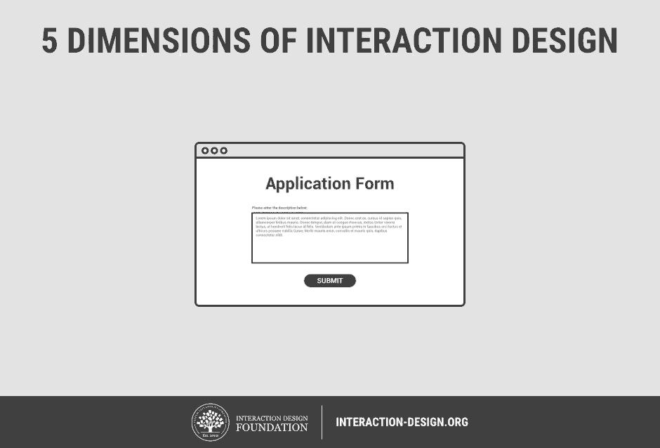

# Lecture B — Week 1

## User Experience Design

It’s… [interdisciplinary](https://github.com/envisprecisely/disciplines-of-ux)… to say the [least](https://public-media.interaction-design.org/images/encyclopedia/human_computer_interaction_hci/Interaction-Design-Disciplines.jpg).
<!-- Source: https://www.interaction-design.org/literature/book/the-encyclopedia-of-human-computer-interaction-2nd-ed/human-computer-interaction-brief-intro -->

Initials|Term
---|---
UX | User Experience
IxD | Interaction Design

## Interaction Design

- [Media Equation](https://en.wikipedia.org/wiki/The_Media_Equation)
  - “How People Treat Computers […] like Real People and Places”
  - “404” × “This is embarassing…”
  - [how-i-experience-web-today.com](https://how-i-experience-web-today.com/)

### Dimensions
- [5 Dimensions of Interaction Design](https://www.interaction-design.org/literature/topics/interaction-design)

I personnaly think _behavior_ is the most interesting.

## Preparation

### Pick & Present

Pick a website or app you hate using.

You don’t need to hate the _whole_ thing – just one bad interaction is enough. This could be, for example:

- A website with annoying ads or pop-ups
- An app forcing you to enter the same information twice
- A feature that does not make sense
- An interaction that does not feel intuitive
- etc…

Please bring these to class for discussion:

- 🌎 URL (example.com); or
- 📱 Screen capture or recording
