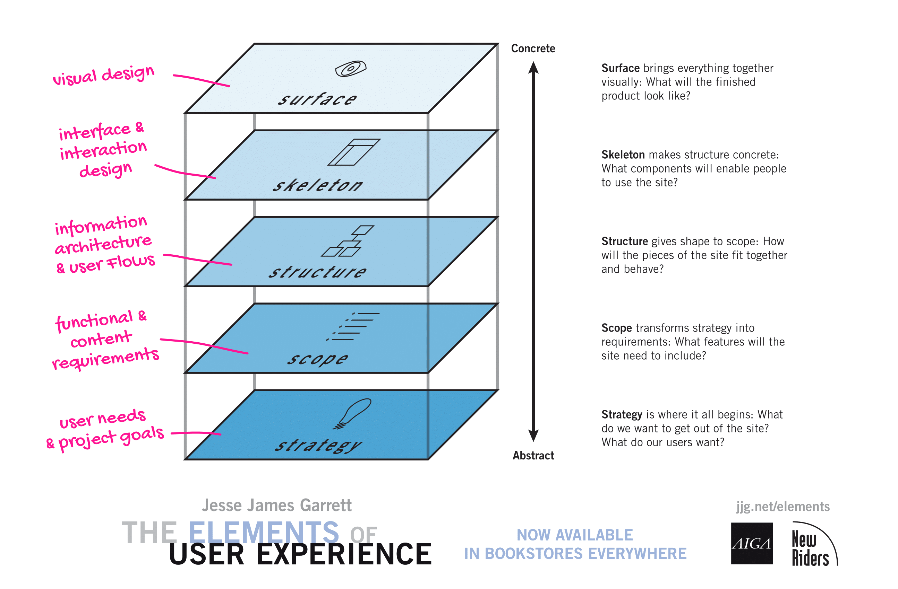
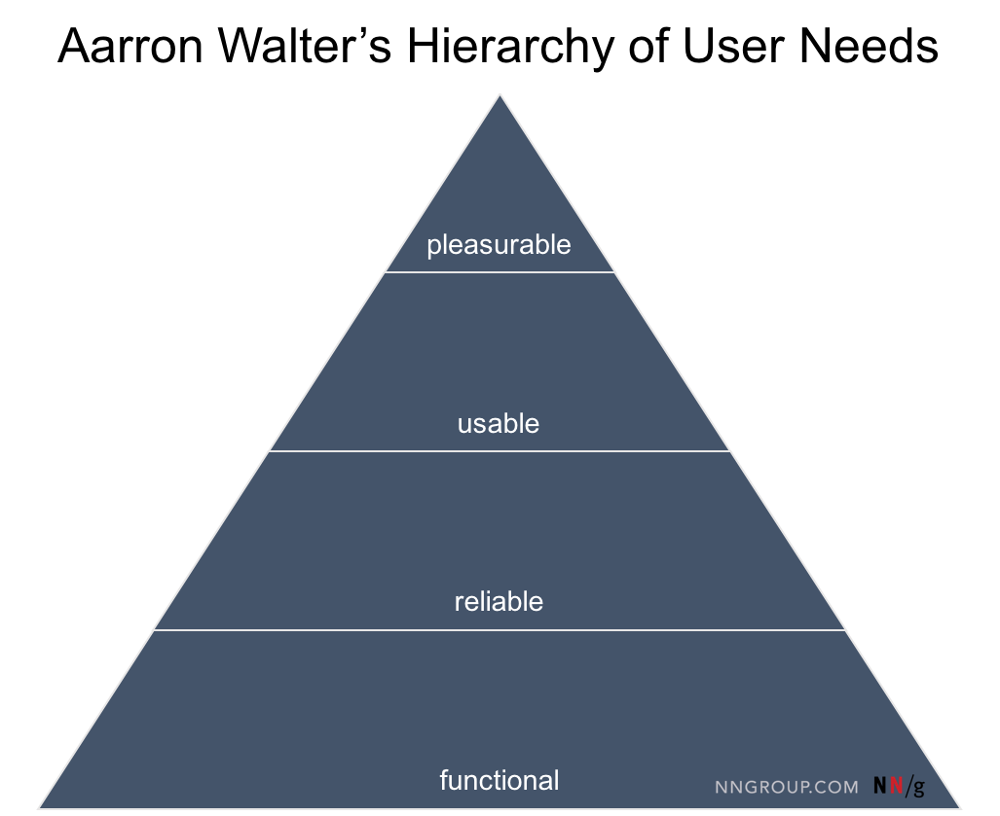
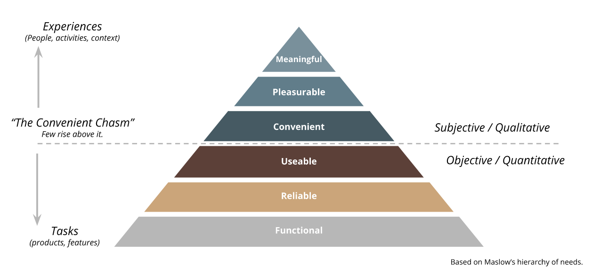

# Lecture A — Week 2

## In simple terms…

Term | Definition
---|---
UX | The user’s perception of interacting with a product
IxD | How a user and a product interact with each other

## Similar things, different names…

### The approach

`User-Centered Design` ≈ `Human-Centered Design` ≈ `Design Thinking`

### The process

Source | Step 1 | Step 2 | Step 3 |
---|---|---|---
[NNGroup](https://www.nngroup.com/articles/design-thinking/) | Understand | Explore | Materialize
[IDEO](https://www.designkit.org/human-centered-design) | Inspiration | Ideation | Implementation

## How do we evaluate products?

### The Elements of User Experience 
A.k.a. “Full UX Stack”. Created by [Jesse James Garrett](https://en.wikipedia.org/wiki/Jesse_James_Garrett)

Adapted from the [simplified](http://www.jjg.net/elements/pdf/elements_simpleplanes.pdf) and [original](http://www.jjg.net/elements/pdf/elements.pdf) diagrams. Topics in pink *partially* represents my own view on the topic.

### Hierarchy of User Needs
A.k.a. “UX Pyramid”. Created by [Aaron Walter](https://aarronwalter.com), inspired by Maslow’s classic [Hierarchy of Needs](https://en.wikipedia.org/wiki/Maslow%27s_hierarchy_of_needs#/media/File:Maslow's_Hierarchy_of_Needs2.svg).

Personal examples from instructor:
- Not functional: [Jesse’s blog](http://blog.jjg.net/)
- Functional, but not realiable: [DS-160](https://ceac.state.gov/ceac/)
- Functional and reliable, but not usable: [Estadão](https://www.estadao.com.br/)
- Funcional, reliable and useable, but not pleasurable: [SciAm](https://www.scientificamerican.com/)
- Funcional, reliable, useable and pleasurable: [GeoGuessr](https://geoguessr.com)

Alternative, more detailed, version:

### Norman’s Principles of Design
A.k.a “IxD Principles”. Created by [Don Norman](https://www.nngroup.com/people/don-norman/). Here is a simplified version:

Principle | Description
---|---
Visibility | Make important information visible
Feedback | Provide feedback about processes
Constraints | Restrict interactions in a context
Mapping | Effects of controls should be obvious
Consistency | Similar controls, similar effects
Affordance | Provide clues about use of controls

A nice overview of the principles can be read [here](https://principles.design/examples/don-norman-s-principles-of-design).

## Preparation

### Figma Mirror

Next class will be hands on. We’ll build a simple interactive prototype together (using a laptop or desktop computer).

However, to simulate how it would look in a smartphone, I recommend you download Figma _in your phone_. We will use it to “mirror” the design you created on your computer.

#### Download
Download the Figma app *on your smartphone*. Please enter the app store on your phone and search for “Figma”. It is likely to be one of these 2 versions:

- [iOS](https://apps.apple.com/lr/app/figma-mirror/id1152747299)
- [Android](https://play.google.com/store/apps/details?id=com.figma.mirror)
