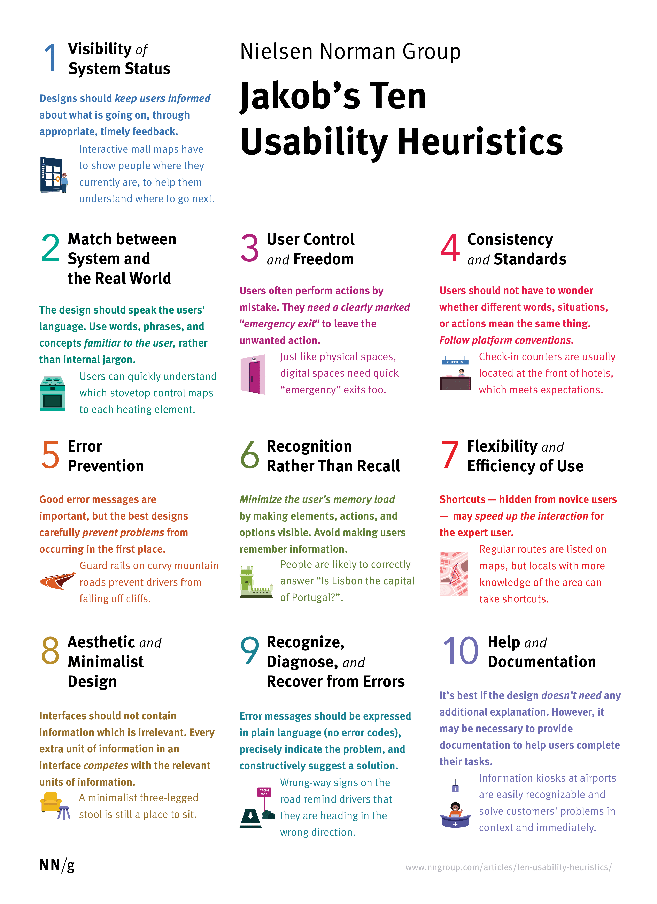

# Lecture B — Week 3

## Analyzing responses from quiz

This was done live during class.

## Three laws of Ixd

### Hick’s Law
The time it takes to make a decision increases with the number and complexity of choices.

Hick’s Law (or the Hick-Hyman Law) is named after a British and an American psychologist team of William Edmund Hick and Ray Hyman. In 1952, this pair set out to examine the relationship between the number of stimuli present and an individual’s reaction time to any given stimulus. As you would expect, the more stimuli to choose from, the longer it takes the user to make a decision on which one to interact with. Users bombarded with choices have to take time to interpret and decide, giving them work they don’t want.

[Read more on IxD Foundation](https://www.interaction-design.org/literature/topics/hick-s-law)

#### Example
- [Binary decision tree](http://powerisunderstanding.blogspot.com/2013/03/the-office-best-character-final-four.html) diagram can make it easier to find your favorite character from a TV show

#### Takeaways
- Minimize choices when response times are critical to increase decision time.
- Break complex tasks into smaller steps in order to decrease cognitive load.
- Avoid overwhelming users by highlighting recommended options.
- Use progressive onboarding to minimize cognitive load for new users.

### Fitt’s Law
The time to acquire a target is a function of the distance to and size of the target.

Psychologist Paul Fitts, examining the human motor system, showed that the time required to move to a target depends on the distance to it, yet relates inversely to its size. By his law, fast movements and small targets result in greater error rates, due to the speed-accuracy trade-off.

#### Example
- In [first-person shooter games](https://duckduckgo.com/?q=fps+games), it is harder to get a headshot than to hit other body parts (or miss, in my case).

#### Takeaways
- Touch targets should be large enough for users to accurately select them.
- Touch targets should have ample spacing between them.
- Touch targets should be placed in areas of an interface that allow them to be easily - acquired.

### Miller’s Law
The average person can only keep 7 (plus or minus 2) items in their working memory.

In 1956, George Miller asserted that the span of immediate memory and absolute judgment were both limited to around 7 pieces of information. The main unit of information is the bit, the amount of data necessary to make a choice between two equally likely alternatives.

#### Example
- Nicky Case has a great video on how [“Human Brains Are Awesome, Humans Brains Suck”](https://vimeo.com/327793736) and how this applies to game design.

#### Takeaways
- Don’t use the “magical number seven” to justify unnecessary design limitations.
- Organize content into smaller chunks to help users process, understand, and memorize easily.
- Remember that short-term memory capacity will vary per individual, based on their prior knowledge and situational context.

### BONUS: Aesthetic-Usability Effect
Users often perceive aesthetically pleasing design as design that’s more usable.

The aesthetic-usability effect was first studied in the field of human–computer interaction in 1995. Researchers Masaaki Kurosu and Kaori Kashimura from the Hitachi Design Center tested 26 variations of an ATM UI, asking the 252 study participants to rate each design on ease of use, as well as aesthetic appeal. They found a stronger correlation between the participants’ ratings of aesthetic appeal and perceived ease of use than the correlation between their ratings of aesthetic appeal and actual ease of use.

#### Example
My Front End Funtamentals students were able to pin down specific UX issues with [Zara’s website](https://www.zara.com), EVEN THOUGH it is a very beautiful website.

#### Takeaways
- An aesthetically pleasing design creates a positive response in people’s brains and leads them to believe the design actually works better.
- People are more tolerant of minor usability issues when the design of a product or service is aesthetically pleasing.
- Visually pleasing design can mask usability problems and prevent issues from being discovered during usability testing.

## Reading for next class

Please read the [10 Usability Heuristics for User Interface Design](https://www.nngroup.com/articles/ten-usability-heuristics/) article, by Jakob Nielsen, from NNGroup.

We’ll discuss these heuristics (or simply “tricks”) next class :)

Here is a summary poster:

## Reminder

Classes will be *in person*, beginning next week (Sep 12).