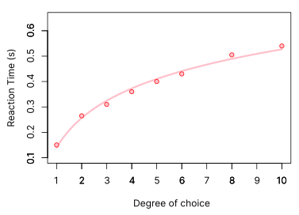

# Lecture A — Week 4

## Impact of a Quiz on Final Grade

The final grade is worth `100` points. 
Quizzes are worth `10` points. 
There are 4 quizzes. 
So each quiz is worth `2.5` points. 
The first quiz has 5 questions. 
So each question is worth `.5` points.

## Changes on Future Quizzes

From now on, quizzes will allow for a **second attempt** – and only the highest score will count.

This will apply to quizzes number 2, 3 and 4.

Big thanks to all students who suggested improvements ✨

## Assignment: Quiz #2

Our next quiz is due by Sep 19 (Monday) at `5:05 pm`. The time limit is right before class starts, so we can discuss the answers during class.

Questions will cover the contents of these classes:
- [Week 1 - Lecture B](../week1-B/)
- [Week 3 - Lecture B](../week3-B/)
- [Week 4 - Lecture A](./)

Quiz should be answered via Blackboard.

## Understanding the Chart for Hick’s Law

The time it takes to make a decision increases with the number and complexity of choices (but not linearly).

Adapted from [Wikipedia](https://en.wikipedia.org/wiki/Hick's_law#Law).

### Takeaways
- Try to keep a very low amount of choices at a given time
- Reducing amount of choices from, say, 4 to 2 has more impact than recucing from 10 to 8 (due to its logarithmic nature).

## Aesthetic-Usability Effect

Users often perceive aesthetically pleasing design as design that’s more usable.

The aesthetic-usability effect was first studied in the field of human–computer interaction in 1995. Researchers Masaaki Kurosu and Kaori Kashimura from the Hitachi Design Center tested 26 variations of an ATM UI, asking the 252 study participants to rate each design on ease of use, as well as aesthetic appeal. They found a stronger correlation between the participants’ ratings of aesthetic appeal and perceived ease of use than the correlation between their ratings of aesthetic appeal and actual ease of use.

### Example
My Front End Funtamentals students were able to pin down specific UX issues with [Zara’s website](https://www.zara.com), EVEN THOUGH it is a very beautiful website.

### Takeaways
- An aesthetically pleasing design creates a positive response in people’s brains and leads them to believe the design actually works better.
- People are more tolerant of minor usability issues when the design of a product or service is aesthetically pleasing.
- Visually pleasing design can mask usability problems and prevent issues from being discovered during usability testing. Try using wireframes

---

## Usability Heuristics

Intruce a few(?) of Jakob’s “tricks” for making usable products.

### 1. Visibility of System Status

### 2. Match Between System and the Real World

### 3. User Control and Freedom

### 4. Consistency and Standards

### 5. Error Prevention

### 6. Recognition Rather Than Recall

### 7. Flexibility and Efficiency of Use

### 8. Aesthetic and Minimalist Design

### 9. Recognize, Diagnose, and Recover from Errors

### 10. Help and Documentation