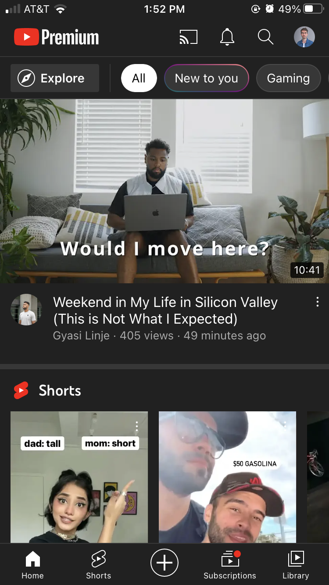

# Lecture B — Week 4

## Prototyping with Figma

[Figma](https://www.figma.com/) is the tool we will use to simulate how our digital products would be like.

It allows us to *precisely* design how the final product should look. And it does a *decent* job on simulating its *behavior* (how it responds to people’s interaction).

Today we will only focus on the simulating behavior. This is what you are asked to submit for your assessment #1.

### Assessment #1

The goal of this task is to get you familiar with the tool – so you can use it to prototype more sophisticated products for [future assignments](../../#assignments).

Read more about it [here](../../Assignments/assessment-1.pdf).

### Replicating YouTube

Ok, I won’t replicate ALL of YouTube. Only a single interaction. I chose an interaction from the mobile app’s home page: switching categories. Here is what it looks like:

#### Assets

Screen capture:

[▶️ Screen Recording](../../../../media/youtube-screen-recording.mp4)

## Reminder

Quiz is due next class!