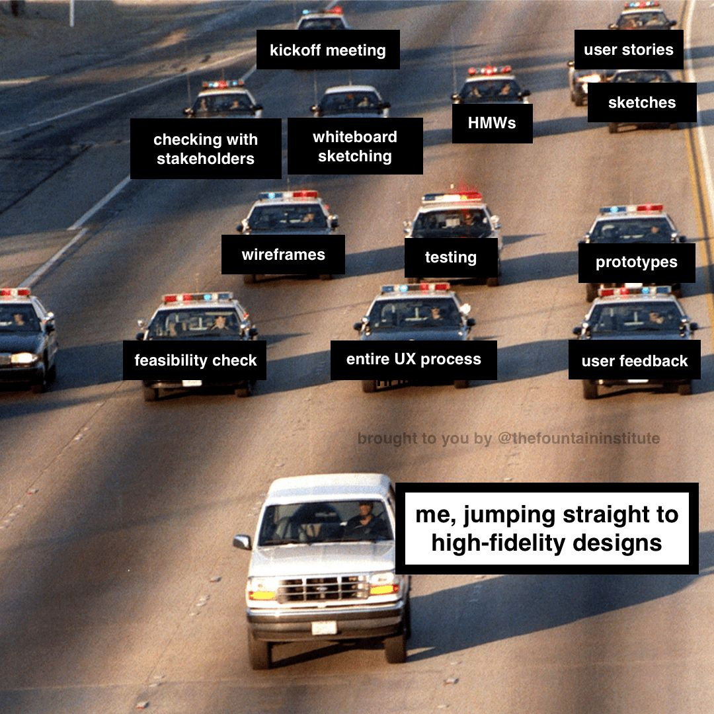
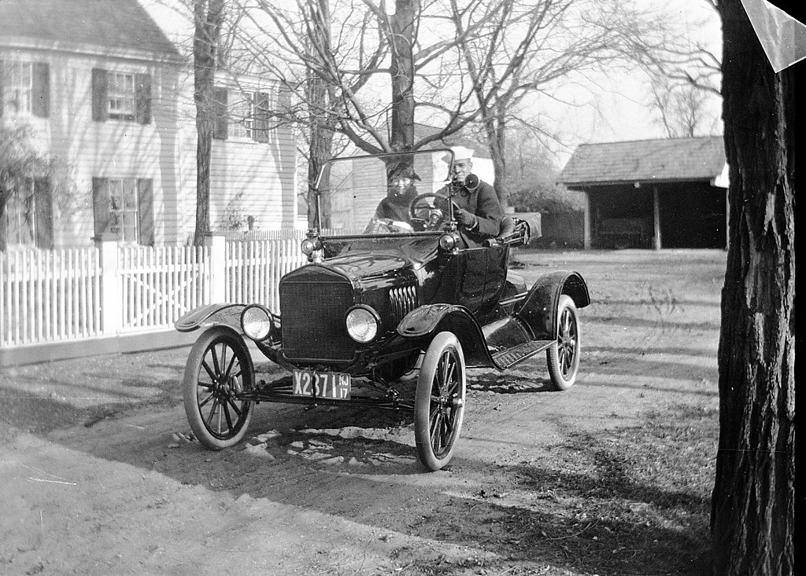
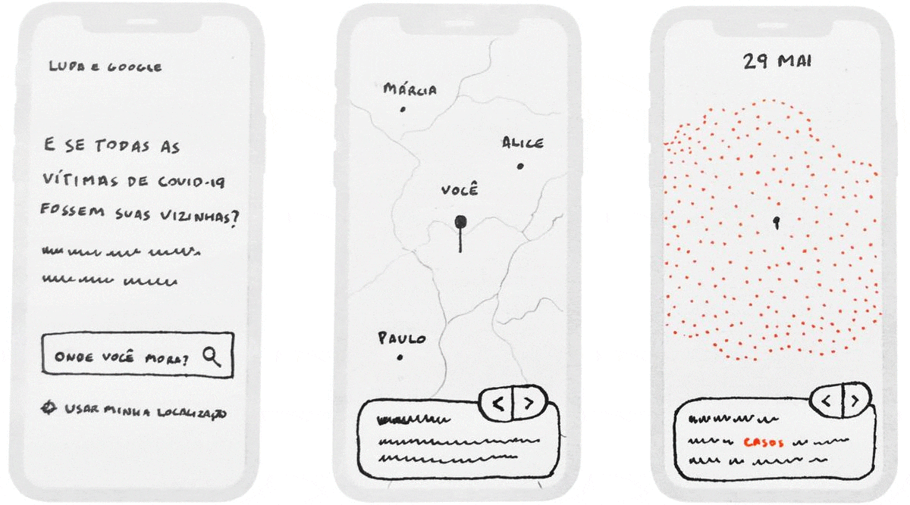

# Lecture B — Week 5

## Discuss Assessment #1

Let’s begin by going over a few interactive prototypes submitted by students.

The goal for the instructor is to understand most common struggles with the tool (Figma) – and address them.

The goal for students is to gain repertoire on what is possible to prototype with the tool.

💡 If you haven’t already, submit it by 23:59 pm today.

## Recap Design Project #1

Here are the details of our [first Design Project](../../Assignments/design-project-1.pdf).

## Expand on Design Thinking

This is a definition, from [NNGroup](https://www.nngroup.com/articles/design-thinking/), that I find really insteresting:

> The design thinking *ideology* asserts that a hands-on, user-centric approach to problem solving can lead to innovation, and innovation can lead to differentiation and a competitive advantage.

This approach is defined by a process, which involves *understanding* human needs, *exploring* possible solutions, and *materializing* those ideas.

Going through this process increases our chances of success (when compared to simply implementing the first idea that comes to mind).

### 1. Understand

This step is **NOT** about asking people _what they want_. 

I have seen people disregard this step – and even back it up with fake quotes. This one is often attributed to *Henry Ford* [without evidence](https://hbr.org/2011/08/henry-ford-never-said-the-fast):

> “If I had asked people what they wanted, they would have said **faster horses**.”

This step is about uncovering human needs.

I personally believe this can be achieved by combining quantitative & qualitative research methods, but also intuition.

> In this phase, you talk to a range of actual users.  Directly observe what they do, how they think, and what they want, asking yourself things like ‘what motivates or discourages users?’ or ‘where do they experience frustration?’

Excerpt from [NNGroup’s Design Thinkin 101 article](https://www.nngroup.com/articles/design-thinking/).

### 2. Explore 

This is step is about generating ideas (as crazy as they sound).

But don’t worry, we will filter them out later (based on real-world constraints – like feasibility or viability).

I like to think that for every product we see, there is a trail of abandoned ideas behind it:

<blockquote class="twitter-tweet">
New English version — Along with <a href="https://twitter.com/GoogleNewsInit?ref_src=twsrc%5Etfw">@GoogleNewsInit</a> and <a href="https://twitter.com/agencialupa?ref_src=twsrc%5Etfw">@agencialupa</a>, we created a map that puts you at the epicenter of the Covid-19 pandemic in Brazil. The loss of near 100,000 lives may seem distant to most of us. But what if they were all your neighbors? <a href="https://t.co/sVXfwKTyCy">https://t.co/sVXfwKTyCy</a> <a href="https://t.co/lHzPn93bSS">pic.twitter.com/lHzPn93bSS</a>
&mdash; Vinicius Sueiro (@viniciussueiro) <a href="https://twitter.com/viniciussueiro/status/1290267209634217990?ref_src=twsrc%5Etfw">August 3, 2020</a></blockquote>  

<iframe style="border: 1px solid rgba(0, 0, 0, 0.1);" width="100%" height="600" src="https://www.figma.com/embed?embed_host=share&url=https%3A%2F%2Fwww.figma.com%2Ffile%2FvT0ZkbKerSEglVODNCdqEg%2FCreative-process%3Fnode-id%3D0%253A1" allowfullscreen></iframe>

### 3. Materialize

This step is about expressing your ideas.

> Build real, tactile representations for a subset of your ideas. The goal of this phase is to understand what components of your ideas work, and which do not. In this phase you begin to weigh the impact vs. feasibility of your ideas through feedback on your prototypes.

Excerpt from [NNGroup’s Design Thinkin 101 article](https://www.nngroup.com/articles/design-thinking/).

---

## Reminder

💡 The Part I of the first Design Project is due next Monday. Please submit it via Blackboard :)