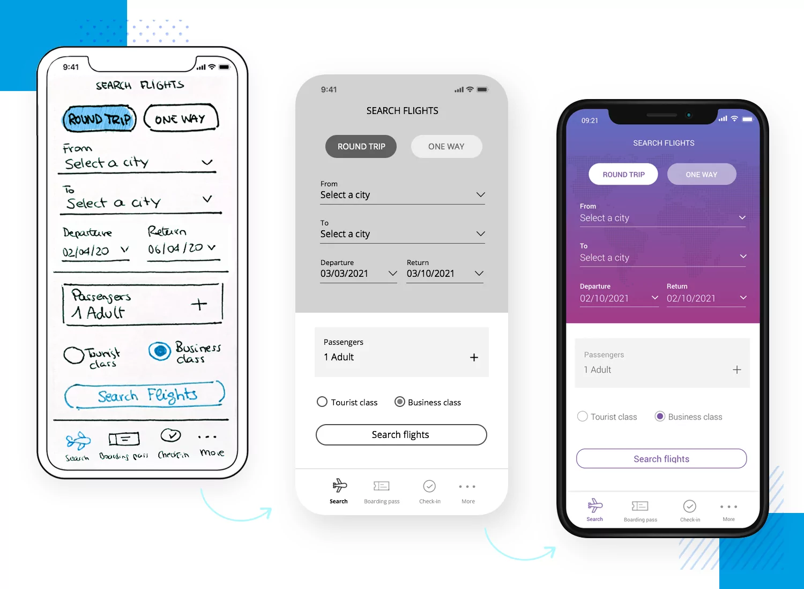

# Lecture A — Week 7

## Recap Design Project #1

Here are the details of our [first Design Project](../../Assignments/design-project-1.pdf).

### Introducing Part II

Now that you have defined user goals and and sketched wireframes on paper, it’s time to make them digital.

Using Figma, the second part of this project ask you to build the interface in **2 steps**:

#### Step 1: Digital Wireframe (ugly)

Create a page on Figma called `Wireframe`.

Recreate your paper wireframe as a low-fidelity digital one.

It should NOT have color or images, and focus ONLY on the layout and placement of your content. You may use labels or annotations to explain what the final content will be.

#### Step 2: Digital Mockup (not so ugly)

*Duplicate* your page and remate it to `Mock-up`.

Apply visual style to the user interface (UI).

Your mock-up should NOT have any prototyping or interaction at this point. It should be a static set of screens.

#### Low fidelity? High fidelity?

This figure shows a low, medium and high-fidelity version of the same app. 

Source: [Article by Justinmind about prototypes](https://www.justinmind.com/prototyping/low-fidelity-vs-high-fidelity-prototypes).

---

## Reminder

💡 Part I of the first Design Project is due **TODAY**.
💡 Part II of the first Design Project is due next **Monday**.

Please submit them via Blackboard :)
