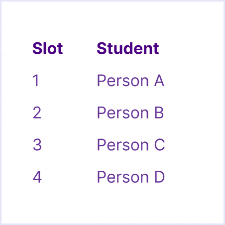

<link rel="stylesheet" href="https://vsueiro.com/syllabus-generator/lib/timeline.css">

# Syllabus — Interaction Design

This is the main document for the CIM 102 (section EF) course at University of Miami, fall 2023.

🗓 Classes on Mondays and Wednesdays, from `12:30 PM` to `1:45 PM`.

| Lecturer                                                          | Email           |
| ----------------------------------------------------------------- | --------------- |
| [Vinicius Sueiro](https://com.miami.edu/profile/vinicius-sueiro/) | vss43@miami.edu |

This document is subject to change.

## Course Description

In this class, students will familiarize themselves with the disciplines of user experience (UX) and interaction design (IxD), including design principles, postures, patterns and visual design concepts specific to designing interactive digital products. Students will learn how to use a digital prototyping tool in order to first design low fidelity, structural wireframes and then turn them into high fidelity interactive prototypes.

### Course Goals

By the end of this course, students should be able to:

- Materialize ideas as interactive prototypes
- Collaborate with design teams efficiently
- Apply design thinking skills to other fields

### Course Topics

In order to reach the desired goals, students will learn concepts and techniques related to UX and IxD, including design principles and Figma, a digital tool to prototype interfaces.

### Course Tools

The following are **software applications** for this course and are all industry standards. These are all free when logging in with your UM Cane ID or signing up with your UM email address.

- [Blackboard](https://courses.miami.edu/): This is the course management system where you’ll submit your assignments. Students and faculty are automatically enrolled in their courses.
- [Figma](https://figma.com/): Get verified to access our Education plan and get all of the paid perks of our Professional plan for free.
- `Optional` [Adobe Creative Cloud](https://adobe.com/): Free when signing in with your CaneID as an Enterprise ID (in lieu of an Adobe ID) .

During class activities, the use of a laptop with internet access is encouraged. You will also need access to a smartphone and/or tablet for reference purposes.

If you do not have a laptop or a smartphone available to you regularly, please let your instructor know.

### Course Timeline

We will not learn everything at once. Instead, this course is split into a few steps. Each step builds on top of what we learned from the previous one. Here is what this progression looks like:

<!--

#### Presentation day

For each project, students will share their initial **planning** and their final **website** with classmates. Since there are 2 projects, this means that each student will present their work 4&times; during the semester.

In order to present, students need to sign-up for 5-min **presentation slots** (instructions will be provided via Blackboard).

#### Peer Feedback

During presentation days, each student must provide feedback to (→) at least 1 classmate, as illustrated below:

##### How does it work?

After one student presents, the next student provides feedback.

After the _last_ student presents, the _first_ student provides feedback.

In essense, your feedback should be about your classmate’s project idea (conceptual) or its execution (technical), in the form of compliments, questions, or suggestions.

-->

### Course Content

The following tables describe what you are expected to do before class (“Preparation”), what we will do during class (“Content”), and what we have done during class (“Materials”).

## Grading

I reserve the right to adjust the final grade according to class participation, attendance, overall quality of work, etc.

### Grading Breakdown

| Step             | Weight    | Assignment            | Task         | Points |
| ---------------- | --------- | --------------------- | ------------ | ------ |
| Introduction     | 5 Points  | Expectations          | Submission   | 5      |
| Design Notebook  | 10 Points | Weekly Critique       | Submission   | 10     |
| Design Exercises | 30 Points | Interactive Prototype | Submission   | 10     |
| \*               | \*        | Animated Prototype    | Submission   | 10     |
| \*               | \*        | User Testing          | Submission   | 10     |
| Design Project 1 | 25 Points | Wireframe             | Submission   | 5      |
| \*               | \*        | Mockup                | Submission   | 5      |
| \*               | \*        | Prototype             | Presentation | 5      |
| \*               | \*        | \*                    | Submission   | 10     |
| Design Project 2 | 25 Points | Wireframe             | Submission   | 5      |
| \*               | \*        | Mockup                | Submission   | 5      |
| \*               | \*        | Prototype             | Presentation | 5      |
| \*               | \*        | \*                    | Submission   | 10     |
| Final Exam       | 5 Points  | Self-reflection       | Submission   | 5      |

#### Missed a task?

Late submissions via Blackboard <em>will</em> be accepted during the semester, but with a **10% grade deduction**.

In case students miss an in-class presentation, they can still submit a video recording via Blackboard, also with a **10% grade deduction**. However, the peer feedback points will be lost.

### Grading Scale

| Grade | Points |
| ----- | ------ |
| A+    | ≥ 97   |
| A     | ≥ 93   |
| A-    | ≥ 90   |
| B+    | ≥ 87   |
| B     | ≥ 83   |
| B-    | ≥ 80   |
| C+    | ≥ 77   |
| C     | ≥ 70   |
| D+    | ≥ 65   |
| D     | ≥ 60   |
| F     | ≥ 0    |

## Office Hours

Students are welcome to schedule individual sessions with the instructor. Please use [Calendly](https://calendly.com/viniciussueiro/office-hours) to pick a specific time slot for our remote (Zoom) meeting. If you want to meet at another day, time, or place, please email your instructor to check availability.

## Policies

    
Religious Holy Day Policy

    

      It is the student’s obligation to provide faculty members with notice of the dates they will be absent for religious holy days. Students are responsible for material covered in class regardless of their presence. The University’s complete Religious Holy Day Policy can be found in the current Bulletin.
    

    
Attendance Policy

    

      Class attendance is critical to the success of hands-on classes, including class participation in discussions and completion of in-class assignments. All students are responsible for material covered in the classroom regardless of their presence; therefore, check the class Blackboard for announcements, assignment requirements and due dates. Do not email your instructor to find out what has been posted to Blackboard.
    

    
Recording Policy

    

      Students are expressly prohibited from recording any part of this course. If any recordings are available to students, they are intended to supplement the classroom experience. Students are expected to follow appropriate University policies and maintain the security of passwords used to access recorded lectures. Recordings may not be reproduced, shared with those not in the class, or uploaded to other online environments.
    

    
Honor Code & Plagiarism Statements

    

      Students enrolled in this course are expected to abide by the University of Miami Honor Code. The purpose of the Honor Code is to protect the academic integrity of the University by encouraging consistent ethical behavior in assigned coursework. Academic dishonesty of any kind, for whatever reason, will not be tolerated.
    

    

      No honest student wants to be guilty of the intellectual crime of plagiarism, even unintentionally. Therefore, we provide you with these guidelines so that you don’t accidentally fall into the plagiarism trap.
    

    

      Plagiarism is the taking of someone else’s words, work, or ideas, and passing them off as a product of your own efforts. Plagiarism may occur when a person fails to place quotation marks around someone else’s exact words, directly rephrasing or paraphrasing someone else’s words while still following the general form of the original, and/or failing to issue the proper citation to one’s source material.
    

    

      In student papers, plagiarism is often due to:
    

    <ul>
      <li>Turning in someone else’s work as one’s own</li>
      <li>Using another person’s data or ideas without acknowledgment</li>
      <li>Failing to cite a written source (printed or internet) of information that you used to collect data or ideas</li>
      <li>Copying an author’s exact words and putting them in the paper without quotation marks</li>
      <li>Rephrasing an author’s words and failing to cite the source</li>
      <li>Copying, rephrasing, or quoting an author’s exact words and citing a source other than where the material was obtained</li>
      <li>Using wording that is very similar to that of the original source, but passing it off as one’s own</li>
    </ul>

  
Use of Artificial Intelligence

  

    ChatGPT and other Generative Artificial Intelligence (AI) software may be useful tools for enhancing learning, productivity, and creativity. For instance, they can assist with brainstorming, finding information, and creating materials, such as text, images, and other media. However, these tools must be used appropriately and ethically, and you must understand their limitations.
  

  

    AI should help you think, not think for you. AI tools may be used to help generate ideas, frame problems, and perform research. It can be a starting point to your own thought process, analysis, and discovery. Do not use them to do your work for you, e.g., do not enter an assignment question into ChatGPT and copy & paste the response as your answer. The use of AI must be open and documented. The use of any AI in the creation of your work must be declared in your submission and explained. Your faculty can provide guidance as to the format and contents of the disclosure.
    

  

    If you use AI tools in any part of your work, you are responsible for the final product of that work, both academically and in the workforce.
  

## Well-Being Resources & Support

As you complete your coursework, consider how you can maintain your health and well-being as a top priority. To help you become familiar with the many programs and services available on campus, review the information collected on the Student Well-Being and Resiliency website available at [miami.edu/well-being](https://miami.edu/well-being).

Please reach out to your instructor or any of the resources listed on the site if you need assistance or support throughout the semester.
